## Диаграммы состояний (State Diagram)

###### 1. Состояние пользователя
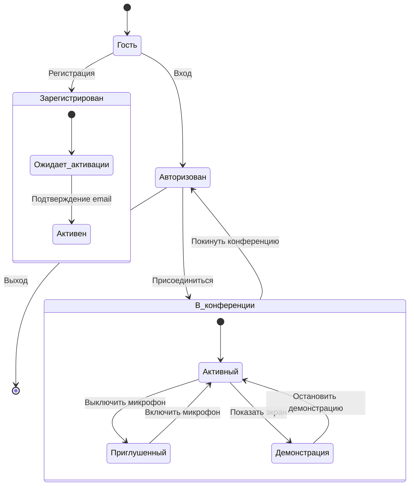
##### 2. Состояние конференции
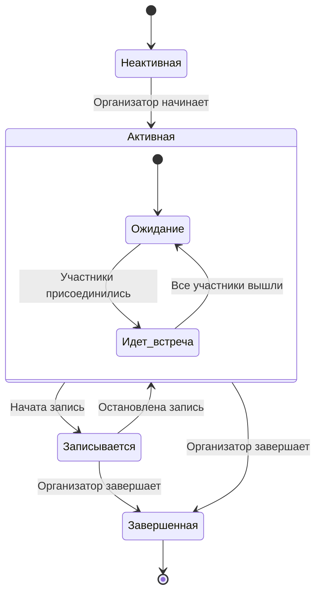

## Use Case диаграммы 
  
##### 1. Основные возможности

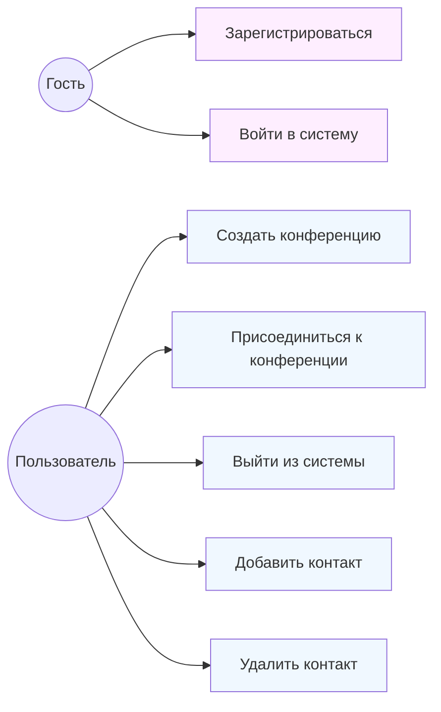

##### 2. Возможности в конференции

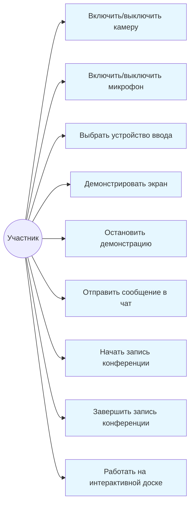

##### 3. Работа с интерактивной доской
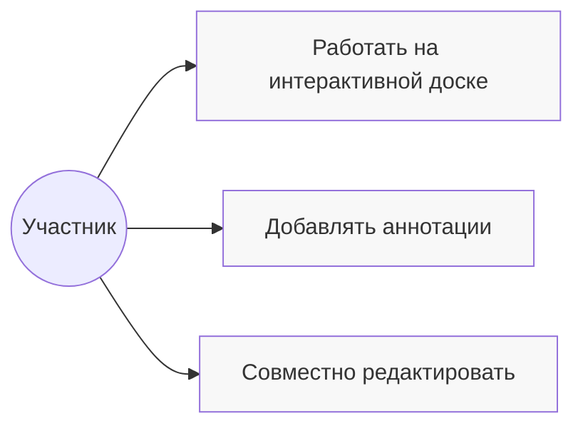

## Диаграммы последовательностей (Sequence Diagrams)

##### 1. Регистрация

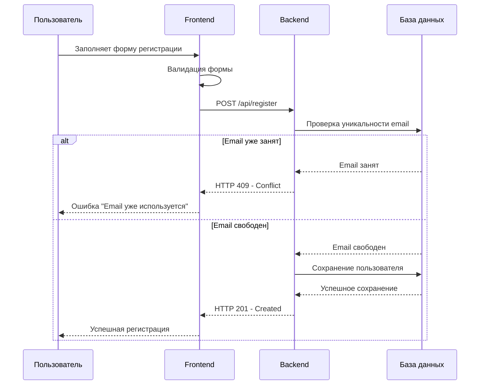

##### 2.  Вход
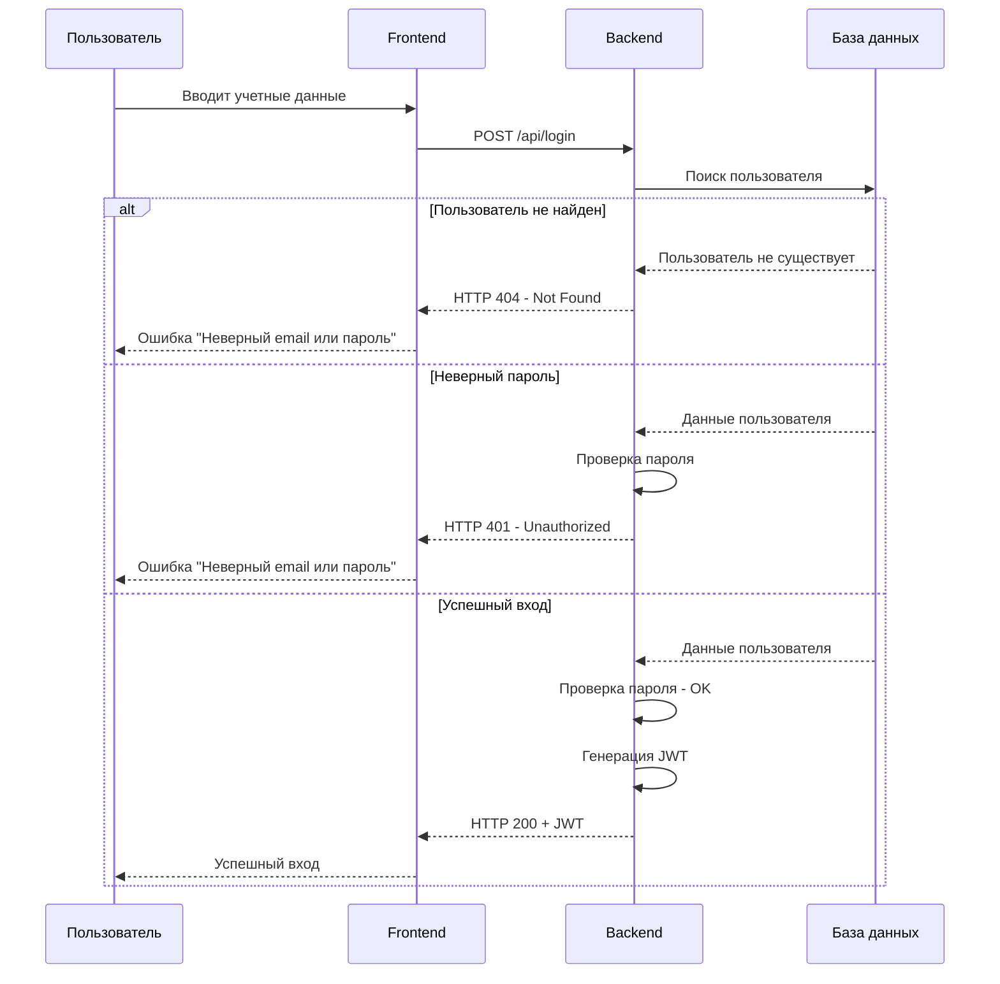

##### 3. Создание и проведение конференции

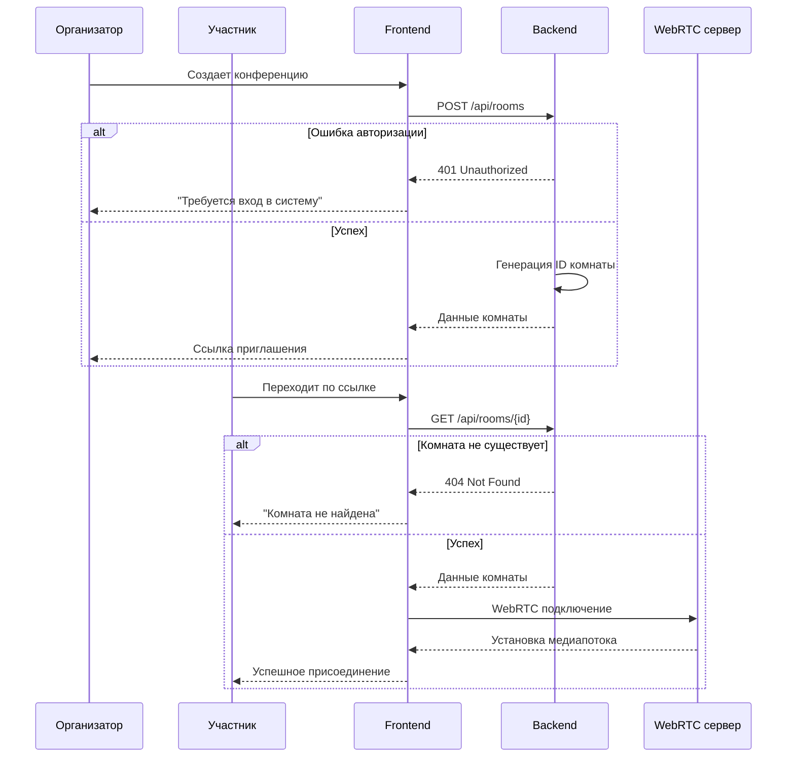

##### 4. Взаимодействие в конференции
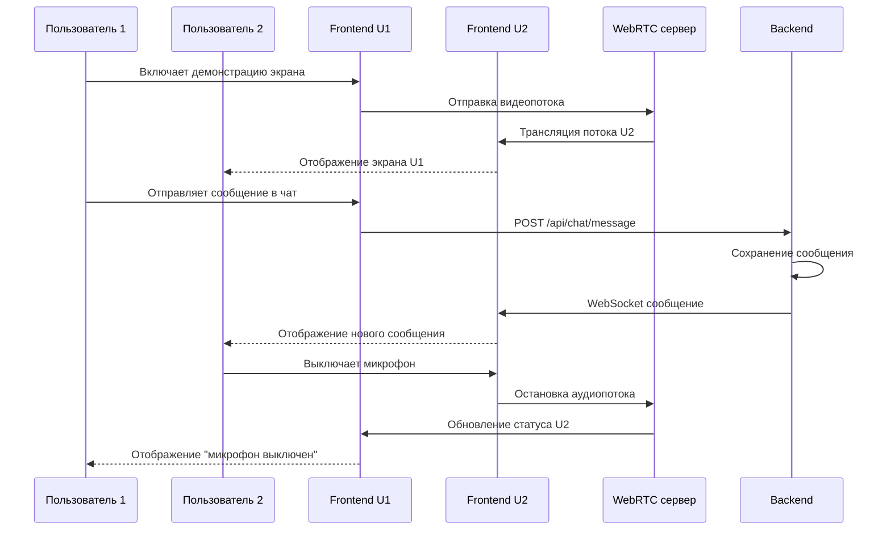

##### 5. Работа с интерактивной доской

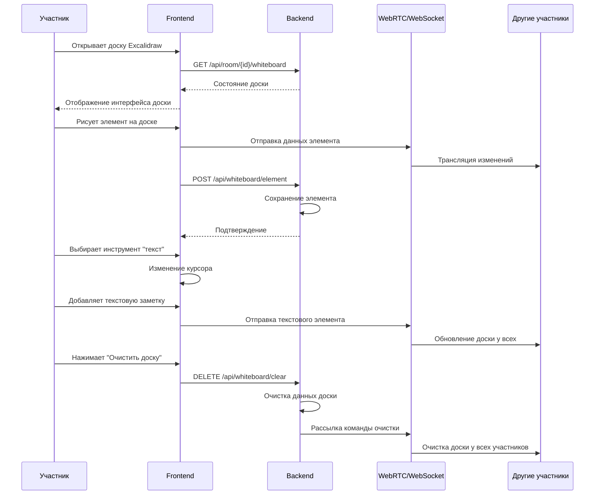

##### 6. Добавление  пользователя в контакты

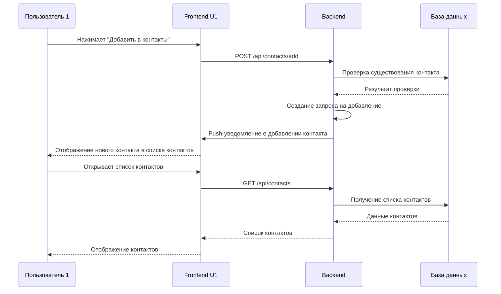
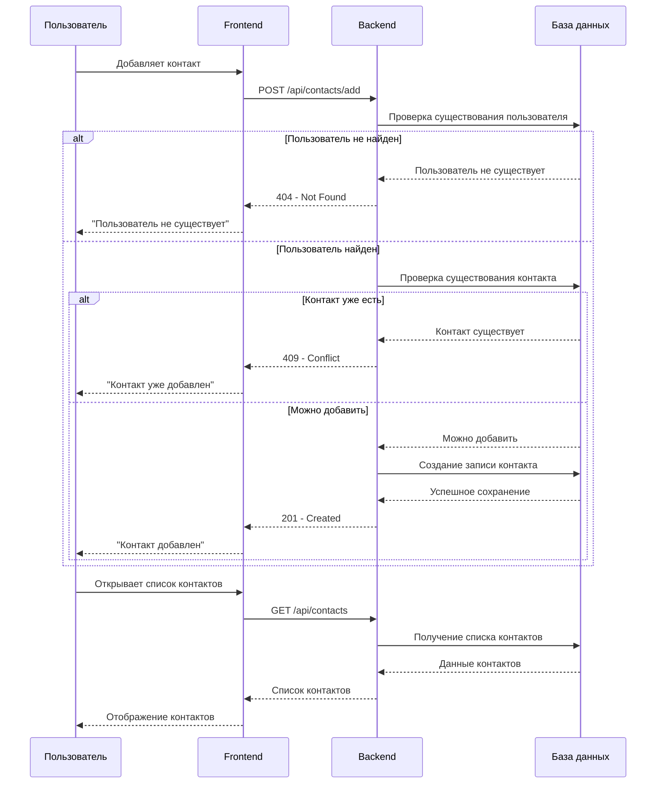

##### 7. Запись конференции любым участником

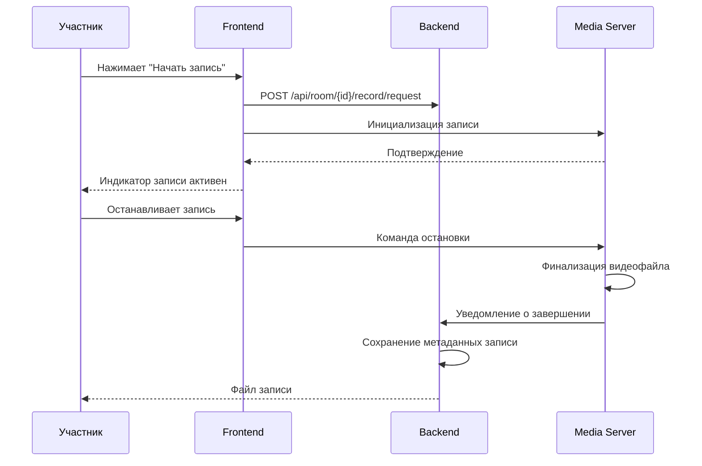
